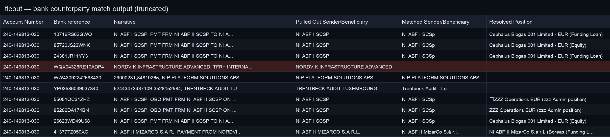

# tieout

**Every cell tied to its source.**

Human-reviewed spreadsheet reconciliation for finance close. The new governed-memory
workflow turns an explicit correction into a scoped, replay-tested rule for future
suggestions. Keep the workbook process; stop solving the same exception from scratch.

**CoreWeave Hacks:** W&B/Weave experiments plus a local correction-memory prototype.
The original reconciliation engine is disclosed prior work from **Syndicate by Maximor** ·
Track 2: Autonomous Office of the CFO · [Devpost](https://syndicate-by-maximor.devpost.com/).

The new workflow is local and human-approved, not autonomous ledger posting or a
production multi-tenant service. See [the product, demo, and pilot plan](docs/COREWEAVE.md).

---

## Docs

| Read | Purpose |
|------|---------|
| [docs/NEO4J.md](docs/NEO4J.md) | Neo4j Aura: cell-lineage graph + lexical GraphRAG |
| [docs/COREWEAVE.md](docs/COREWEAVE.md) | CoreWeave Hacks: the self-improvement loop |
| [docs/SYNDICATE.md](docs/SYNDICATE.md) | Submission summary |
| [docs/demo.md](docs/demo.md) | Demo video script |
| [docs/submit.md](docs/submit.md) | Checklist + Devpost + AO |

---

## Governed close-memory demo (new)

```bash
uv sync --directory research
DEMO_DIR=$(mktemp -d /tmp/tieout-memory-demo.XXXXXX)
uv run --directory research python ../demo/memory_scenario.py --out-dir "$DEMO_DIR"
uv run --directory research marimo run ../demo/close_workspace.py
```

Use the generated database/workbooks in the workspace. The script shows a
synthetic correction, replay gate, explicit activation, second-cycle suggestions,
and revocation. It ends revoked; `evidence.json` preserves every stage and
`cycle2-reviewed.xlsx` preserves the suggestions exported while active. No API
key is needed. This is a functional demonstration, not a measured customer ROI.

## Original reconciliation quick start

```bash
python3 demo/build_fixtures.py
./demo/simulate_demo.sh close-tieout-bank-cp
cd research && uv run python ../harness/exceptions.py review /tmp/syndicate-demo/exceptions.json
```

Live: set `TINKER_API_KEY` from `.env`, then `./demo/run_demo.sh close-tieout-bank-cp`

## Self-improvement loop (CoreWeave Hacks)

Set `WANDB_API_KEY` in `.env` — enables W&B Inference + Weave tracing/evals.

```bash
# pipeline on W&B Inference, traced:
cd research && uv run python ../harness/pipeline.py \
  --dataset-dir ../demo/close-tieout --out-dir /tmp/tieout-wandb \
  --model wandb:meta-llama/Llama-3.3-70B-Instruct

# the loop: eval -> cluster failures -> mutate skills -> re-score -> keep/revert
uv run python loop.py --dataset-dir data/spreadsheetbench_verified_400 \
  --sample 20 --iters 3 --out-dir /tmp/tieout-loop

# dashboard (marimo): accuracy curve + exception review
uv run marimo run ../demo/loop_dashboard.py
```

## Knowledge graph (Neo4j)

Set `NEO4J_URI`/`NEO4J_USER`/`NEO4J_PASSWORD` in `.env` (Aura) — every answer cell becomes a
stable `(:Cell)` node tied to its source cells, the vendor it matched, and the exception it raised,
and the agent reads that vendor memory back to ground column K. Without creds it no-ops: identical
`exceptions.json`, prompts, and scores. Details in [docs/NEO4J.md](docs/NEO4J.md).

```bash
# seed the vendor memory, then write lineage offline (no API key)
cd research && uv run --extra graph python ../demo/seed_graph.py
TIEOUT_RUN_ID=demo ./demo/simulate_demo.sh close-tieout-bank-cp

# read candidates back (the GraphRAG retrieval), or run live with the read on
cd research && uv run --extra graph python ../harness/graph.py query "NIP LIT"
TIEOUT_GRAPHRAG=1 ./demo/run_demo.sh close-tieout-bank-cp
```

## Example output

Bank counterparty match: `Matched Sender/Beneficiary` filled where the lookup resolves; empty cells are routed to `exceptions.json` with source-row evidence.



---

## Layout

```
docs/       SYNDICATE.md, demo.md, submit.md
demo/       CFO fixtures + scripts
harness/    agent pipeline
research/   dependencies (uv sync)
```

Built with AO · Python · openpyxl · Tinker (Qwen3.8-27B)
