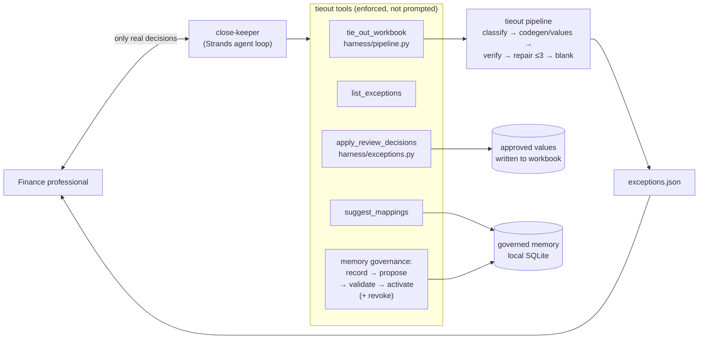

# close-keeper — a Strands agent for the financial close

[](https://molab.marimo.io/github/udirobert/tieout/blob/main/close_keeper/demo_app.py)

**Professional Agents track.** Finance professionals lose hours every close to the
same judgment-heavy busywork: tie out the workbook, map the narratives, chase the
exceptions. close-keeper does that work in the background and **only surfaces when
there's a real decision to make** — a flagged cell, a mapping with no approved rule,
a correction that needs governance.

Built with the [Strands Agents SDK](https://github.com/strands-agents/sdk-python)
on top of [tieout](../)'s verified machinery. Every capability is a tool; the
governance rules below are enforced by the tools, not by the prompt.

## The working agreement

- **Blank is an answer.** Cells the pipeline can't verify route to the exception
  queue. The agent never fills a cell on a hunch.
- **One write path.** Approved values are written only through
  `apply_review_decisions` → `harness/exceptions.apply_decisions`, which persists
  the decision before touching any workbook. There is no other way to write.
- **Memory learns through governance.** A correction becomes a rule only via
  `record_correction → propose_rule → validate_rule → activate_rule`. The replay
  gate demands positive, hard-negative, scope-boundary and conflict coverage with
  zero regressions; the tools refuse ineligible activations and double revokes.
- **Attention is the scarce resource.** What reaches the human is a short list:
  cell, why flagged, proposed value, evidence rows.

## Architecture



The agent loop's model is pluggable: W&B Serverless Inference (default when
`WANDB_API_KEY` is present), any OpenAI-compatible endpoint
(`CLOSE_KEEPER_BASE_URL` / `CLOSE_KEEPER_API_KEY` / `CLOSE_KEEPER_MODEL`), or
Amazon Bedrock via Strands' default (`--bedrock`). The tie-out pipeline's own
model is configured independently in `harness/pipeline.py`.

## Run it

```bash
uv sync --directory research --extra agent   # adds strands-agents

# tie out the demo close package, surface what needs you
research/.venv/bin/python -m close_keeper \
  "Tie out the close package (all tasks), then tell me which cells need my decision and why."
```

**Live demo (no keys needed):** `demo_app.py` — a guided molab walk through the
exception queue, the recorded write path, and the governance gate, including the
refusals. **Deploy:** [DEPLOY.md](DEPLOY.md) puts the agent on Bedrock AgentCore
Runtime; [policies/](policies/) restates the governance as Cedar at the Gateway
boundary, so a compromised loop still can't write a decision or activate a rule.

Then decide, and the agent writes through the governed path:

```
"Approve Movements Rec!F2 and F3, reject F4."
```

Keys live in the repo `.env` (gitignored): `WANDB_API_KEY` or
`CLOSE_KEEPER_API_KEY` for the agent loop, `TINKER_API_KEY` for the pipeline's
default model. No key is ever echoed to the model.

## Tools

| tool | wraps | writes? |
|---|---|---|
| `tie_out_workbook` | `harness/pipeline.py` | run artifacts in `--out-dir` |
| `list_exceptions` | `exceptions.json` | no |
| `apply_review_decisions` | `harness/exceptions.apply_decisions` | yes — recorded decisions only |
| `preview_workbook` | `research/sb.serialize_workbook` | no |
| `suggest_mappings` | `memory_store.suggest` | no |
| `list_memory_rules` | `memory_store.rules` | no |
| `record_correction` / `propose_rule` / `validate_rule` / `activate_rule` / `revoke_rule` | `harness/memory_store.py` | yes — governed SQLite |

## Verified

End-to-end against `demo/close-tieout` (3 tasks, Tinker Qwen3.8-27B pipeline,
Llama-3.3-70B agent loop on W&B Inference): the agent tied out all tasks, surfaced
24 pending exceptions with evidence, applied a mixed approve/reject decision set
through the recorded write path (approved kept, rejected reverted to init), and
was refused by the governance gate on an ineligible activation and a double
revoke. See `docs/COREWEAVE.md` for the underlying harness verification record.
