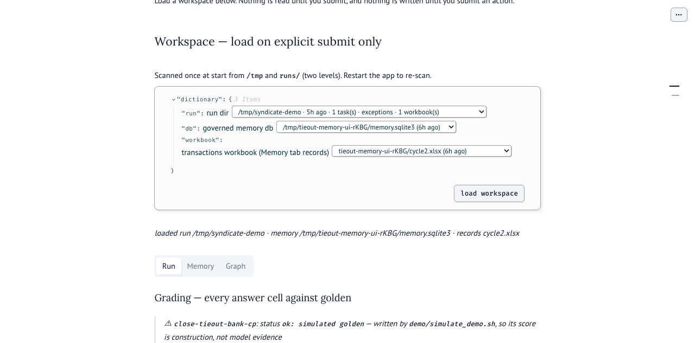
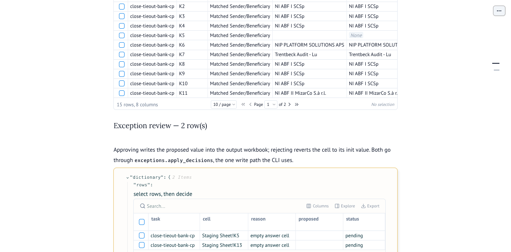
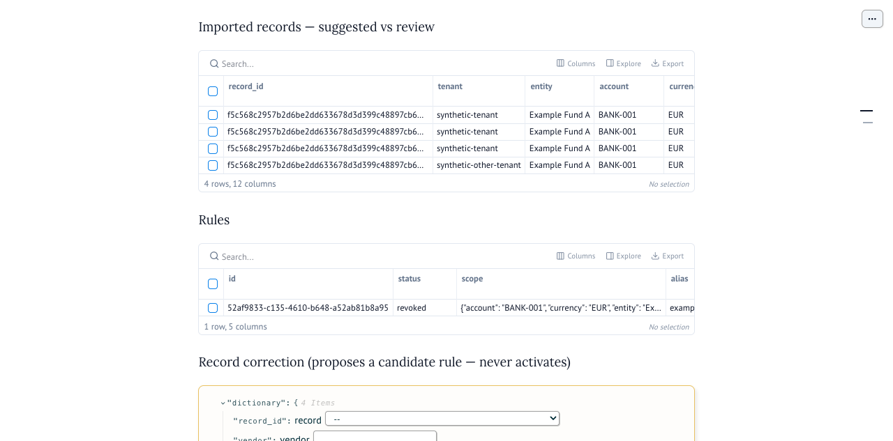
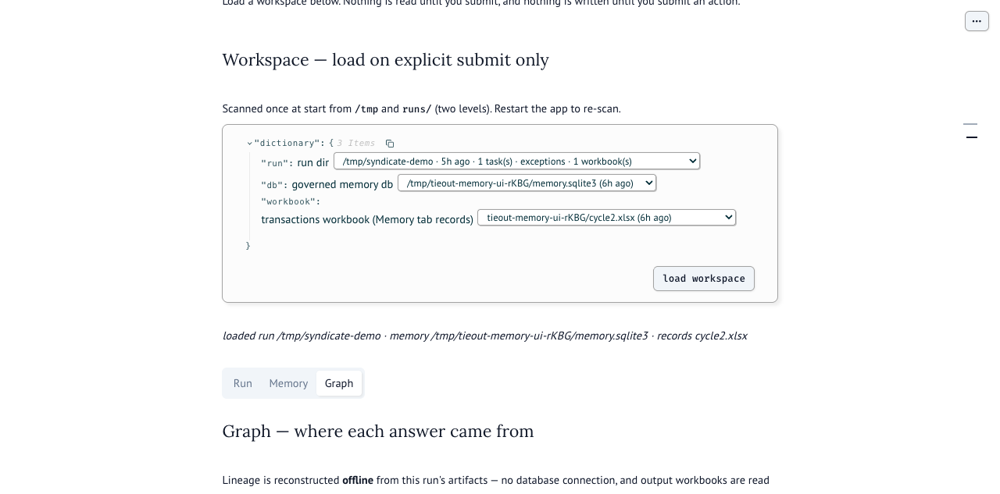
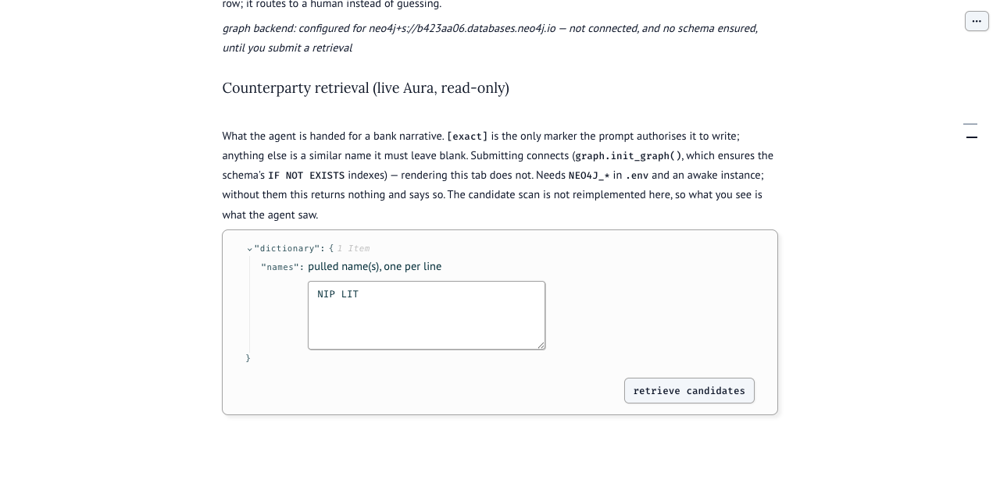

# Documentation — Syndicate submission

**Track:** Autonomous Office of the CFO · **Devpost:** https://syndicate-by-maximor.devpost.com/

Read in this order:

| # | Doc | For |
|---|-----|-----|
| 1 | [**SYNDICATE.md**](SYNDICATE.md) | What tieout is, how it works, how we used AO |
| 2 | [**demo.md**](demo.md) | Demo video script + commands (`close-tieout-bank-cp`) |
| 3 | [**submit.md**](submit.md) | Checklist, Devpost copy, AO install + session log |

Then the two deeper docs, each carrying its own measured caveats:

| Doc | For |
|-----|-----|
| [**COREWEAVE.md**](COREWEAVE.md) | The self-improvement loop and the governed correction memory — review workflow, what is and is not verified |
| [**NEO4J.md**](NEO4J.md) | Optional knowledge graph: cell lineage + counterparty retrieval, the measured read-path A/B, and the fixture's answer-key leak |

**Frontends** (marimo; none required for the CLI demo). `console.py` is the one
surface over all three layers — run grading and exception review, governed
memory, and the lineage graph:

```bash
uv run --directory research marimo run ../demo/console.py           # Run / Memory / Graph tabs
uv run --directory research marimo run ../demo/close_workspace.py   # legacy: governed memory review
uv run --directory research marimo run ../demo/loop_dashboard.py    # legacy: improvement curve + exception review
```

The console's Graph tab needs no database: it replays the run's artifacts through
the same `graph_payload()` a live run used
(`rebuild_graph.lineage_from_artifacts`). Live Aura adds only the candidate
retrieval, on explicit submit. The graph remains readable from the CLI
(`harness/graph.py query`) or from Cypher in the Aura console.

Captured once, under explicit permission, against real artifacts on this machine
(verification boundary in [COREWEAVE.md](COREWEAVE.md#verification-status)). The
run pictured is `/tmp/syndicate-demo`, written by `demo/simulate_demo.sh`, so its
15/15 correctly carries the "construction, not model evidence" banner:

| | |
|---|---|
|  | **Run** — every answer cell graded against golden by `sb.values_equal`, with the simulated-run banner |
|  | **Run** — the exception queue; approve/reject go through `exceptions.apply_decisions` |
|  | **Memory** — governed rules and the suggested-vs-review split on imported records |
|  | **Graph** — lineage rebuilt offline from artifacts; blanks explained as routed-to-human |
|  | **Graph** — one live Aura retrieval: candidates ranked, none `[exact]`, so the gate leaves the cell blank |

**Run the demo:**

```bash
python3 demo/build_fixtures.py
./demo/simulate_demo.sh close-tieout-bank-cp
cd research && uv run python ../harness/exceptions.py review /tmp/syndicate-demo/exceptions.json
```

Code: [`demo/`](../demo/) · [`harness/`](../harness/)
